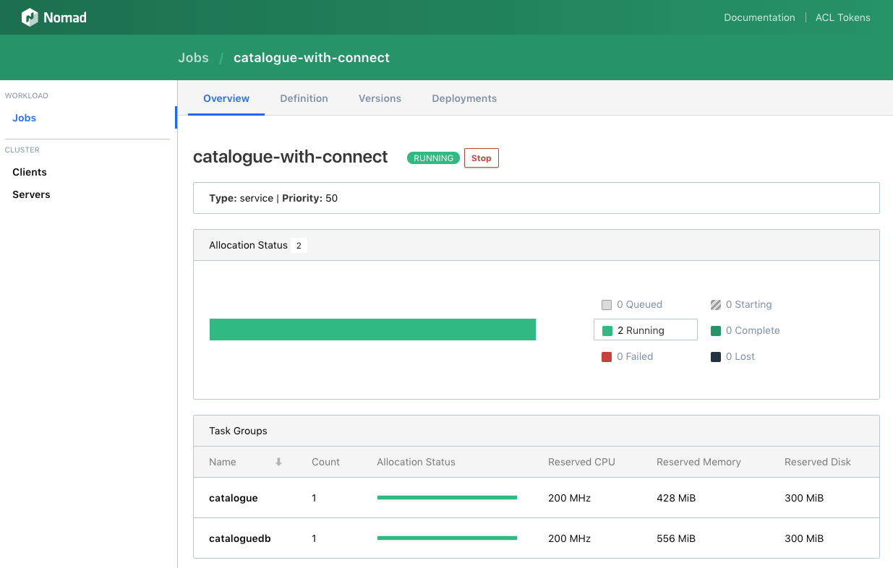
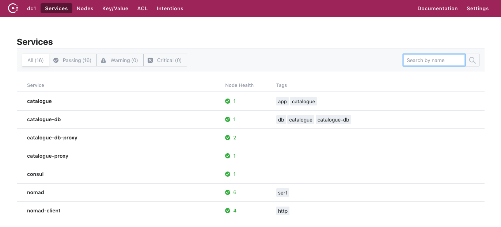
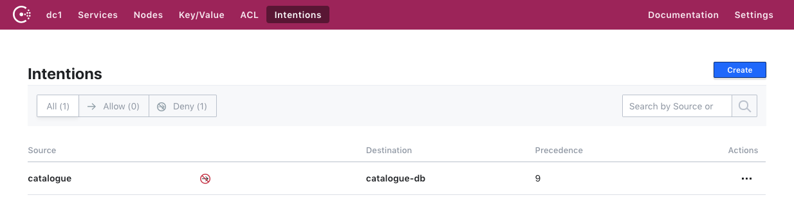

# Running the Catalogue Nomad Consul Connect Demo
The Catalogue Nomad Consul Connect Demo is derived from the Sock Shop microservices demo which illustrates how Nomad and Consul can be used to run and connect microservices.  This demo only uses the catalogue application and catalogue-db database from the broader demo, but adds two Consul Connect proxies in order to show how Consul Connect can allow or deny connectivity between different services in a service mesh. The catalogue application is a go application, the catalogue-db runs MySQL, and both run inside Docker containers.

## What Talks to What
Please note the following facts related to communications:
1. The catalogue and catalogue-db services run in Docker containers using Docker's standard bridge network.
1. The catalogue talks to the catalogue-db database on the upstream port of the catalogue-proxy. That port is dynamically selected by Nomad. The private IP address of the Nomad client is used by the upstream proxy.
1. The catalogue-proxy upstream proxy forwards requests to the catalogue-db service.
1. Knowing that the request to the catalogue-db service came from the upstream proxy, Consul automatically forwards it to the cataloguedb-proxy rather than directly to the catalogue-db service itself.
1. The cataloguedb-proxy forwards the request to the catalogue-db service.
1. Finally, we are using Nomad's distinct_hosts constraint to run the catalogue app and catalogue-db database on different EC2 instances. Since the proxies are defined in the Nomad groups containing the services, Nomad always deploys them to the same clients as their respective services.

Together, all the above points guarantee that the catalogue app can only talk to the catalogue-db database through the Consul Connect proxies, but only if there is no Deny intention prohibiting this.

## How the catalogue-proxy is Run
The Consul Connect proxy, catalogue-proxy, is run by the Nomad task, catalogueproxy, which launches the run-proxy.sh script. This script first registers the catalogue-proxy service definition with Consul using the Consul agent/service/register API endpoint. The service definition is generated from a template contained inside the catalogue-with-connect.nomad job specification file and uses ports dynamically selected by Nomad. The script then runs the proxy with that service definition using the `consul connect proxy -sidecar-for catalogue` CLI command.

Note that the run-proxy.sh script could be used to run multiple proxies within a single Nomad job since the proxy name is passed in with an argument.

The reader might wonder why we first register the service definition and then run `consul connect proxy` with the `-sidecar-for catalogue` arguments instead of running `consul connect proxy -service catalogue -upstream catalogue-db:${NOMAD_PORT_tcp}` which would register the proxy as a service and run it in a single step. We do this because the `consul connect proxy` CLI does not support specifying a local_bind_address for upstream proxies, instead defaulting to 127.0.0.1. An earlier version of this demo did run the longer version of the CLI command without first registering the catalogue-proxy service, but this required us to run the Docker containers on the host network which is generally undesirable. Using the host network was necessary because Docker containers in other networks cannot bind to the host's 127.0.0.1 IP.

## Reference Material
You can learn more about the Sock Shop demo at the [Sock Shop](https://catalogue-connect-demo.github.io/) website.  This repository contains a complete version of the demo in the [microservices](../microservices) directory. A modified version of the [original catalogue repository](https://github.com/catalogue-connect-demo/catalogue) is in this [fork](https://github.com/rberlind/catalogue).

The instructions below describe how you can run and connect the Sock Shop catalogue and catalogue-db microservices in AWS using [Nomad](https://www.nomadproject.io/) and [Consul](https://www.consul.io). Additionally, [Packer](https://www.packer.io) was used to build the AWS AMI that runs Nomad, Consul, and the microservices, while [Terraform](https://www.terraform.io) is used to provision the AWS infrastructure (including a VPC and public subnet and EC2 instances).

## Estimated Time to Complete
15 minutes

## Personas
Our target persona is a developer who wants to run microservices with Nomad and connect them securely with Consul Connect.

## Challenge
Microservices such as the Sock Shop microservices can be deployed to multiple platforms, but securing the connectivity between them has been difficult to manage.

## Solution

This guide illustrates how Nomad can schedule Docker apps and Consul Connect proxies for them in a single deployment. The catalogue app and catalogue-db database are launched using Nomad's Docker Driver. Consul is used for service discovery and segmentation, the latter referring to the imposition of rules that control which services can talk to each other. This is delivered by Consul Connect.

## Prerequisites
In order to deploy the demo to AWS, you will need an AWS account. You will also need to know your AWS access and secret access [keys](http://docs.aws.amazon.com/general/latest/gr/aws-sec-cred-types.html#access-keys-and-secret-access-keys). You'll also need a [key pair](http://docs.aws.amazon.com/AWSEC2/latest/UserGuide/EC2-key-pairs.html) from your AWS account.

If you want to customize the AMI used by the demo, you will need to download and install Packer locally from [Packer Downloads](https://www.packer.io/downloads.html). You can use Terraform Enterprise or open source Terraform to provision the AWS infrastructure the demo runs on. If you want to use open source Terraform, install it from [Terraform Downloads](https://www.terraform.io/downloads.html). This demo was built and tested with Packer 1.3.1 and Terraform 0.11.10.

## Steps
Please execute the following commands and instructions to deploy the AWS infrastructure and run the catalogue microservices with Nomad.

## Step 1: Create a New AMI with Packer (optional)
You can now use Packer and Terraform to provision your AWS EC2 instances along with other AWS infrastructure.

We have already used Packer to create Amazon Machine Image ami-01d821506cee7b2c4 which uses Nomad 0.8.6 and Consul 1.3.0. You can use this as the basis for your EC2 instances. This AMI only exists in the AWS us-east-1 region. If you want to create a similar AMI in a different region or if you make any changes to any of the files in the shared directory, you will need to create your own AMI with Packer. This is very simple. Starting from the home directory, do the following (being sure to specify the region and a vaid source_ami for that region in packer.json if the region is different from us-east-1):

```
export AWS_ACCESS_KEY_ID=<your_aws_key>
export AWS_SECRET_ACCESS_KEY=<your_aws_secret_key>
cd aws/packer
packer build packer.json
cd ..
```

Be sure to note the AMI ID of your new AMI. You will need to enter this in your Terraform variables in Step 4. If you generated this in a region other than us-east-1, then be sure to set the region variable in Step 4.

## Step 2: Create an AWS EC2 Key Pair (if needed)
You need to use one of your AWS EC2 key pairs or [create](http://docs.aws.amazon.com/AWSEC2/latest/UserGuide/EC2-key-pairs.html#having-EC2-create-your-key-pair) a new one. Please download your private key and copy it to the aws directory to make connecting to your EC2 instances easier in Step 6.

## Step 3: Set Up and Configure Terraform Enterprise (optional)
1. If you do not already have a Terraform Enterprise (TFE) account, self-register for an evaluation at https://app.terraform.io/account/new.
1. After getting access to your TFE account, create an organization for yourself. You might also want to review the [Getting Started](https://www.terraform.io/docs/enterprise/getting-started/index.html) documentation.
1. Connect your TFE organization to GitHub. See the [Configuring Github Access](https://www.terraform.io/docs/enterprise/vcs/github.html) documentation.

If you want to use open source Terraform instead of TFE, you can clone this repository locally, create a copy of the included terraform.tfvars.example file, calling it terraform.auto.tfvars, set values for the variables in it as directed in Step 4, run `terraform init`, and then run `terraform apply`.

## Step 4: Configure a Terraform Enterprise Workspace
1. Fork this repository by clicking the Fork button in the upper right corner of the screen and selecting your own personal GitHub account or organization.
1. Create a workspace in your TFE organization called catalogue-connect-demo.
1. Configure the workspace to connect to the fork of this repository in your own Github account.
1. Set the Terraform Working Directory to "application-deployment/consul-connect-with-nomad/aws".
1. On the Variables tab of your workspace, add Terraform variables as described below.
1. If you used Packer to build a new AMI, set the ami variable to the AMI ID of the new AMI; otherwise, you can use the default value. If you built your AMI in a region different from us-east-1, then set the region variable to that region and set the subnet_az variable to an availability zone in that region.
1. Set the key_name variable to the name of your private key and set the private_key_data variable to the contents of the private key. Be sure to mark the private_key_data variable as sensitive.
1. Set the variables name_tag_prefix and cluster_tag_value to something like "\<your_name\>-catalogue-connect-demo".
1. HashiCorp SEs should also set the owner and ttl variables which are used by the AWS Lambda reaper function that terminates old EC2 instances.
1. Set the AWS_ACCESS_KEY_ID and AWS_SECRET_ACCESS_KEY environment variables to your AWS access and secret keys.

Now, you're ready to use Terraform Enterprise to provision your EC2 instances with the Nomad and Consul servers and clients.  The default configuration creates 1 server instance running Nomad and Consul servers and 2 client instances running Nomad and Consul clients. Your catalogue app and catalogue-db database will be deployed by Nomad as Docker containers to the client instances. The Nomad distinct_hosts constraint is used to run them on distinct clients. (That is why we run two clients.)

If desired, you can set the vpc_cidr and subnet_cidr to valid CIDR ranges. The defaults are "10.0.0.0/16" and "10.0.1.0/24" respectively.

## Step 5: Provision the Nomad Consul Connect Demo
1. Click the "Queue Plan" button in the upper right corner of your workspace.
1. On the Current Run tab, you should see a new run. If the plan succeeds, you can view the plan and verify that the AWS infrastructure including the Nomad/Consul server and clients will be created when you apply your plan.
1. Click the "Confirm and Apply" button to actually provision everything.

When the apply finishes, you should see a message giving the public and private IP addresses for your server and clients instances along with a command to ssh to your server and URLs to access the Nomad and Consul UIs.  In your AWS console, you should be able to see all your instances under EC2 Instances. If you were already on that screen, you'll need to refresh it.

Note that Nomad and Consul will automatically be started and that Nomad will run the catalogue-with-connect job.

## Step 6: Verification that Consul and Nomad are Running
From a directory containing your private EC2 key pair, you can connect to one of your Nomad servers with `ssh -i <key> ubuntu@<server_public_ip>`, replacing \<key\> with your actual private key file (ending in ".pem") and \<server_public_ip\> with the public IP of your server instance. The exact command should have been in the outputs of the apply.

After connecting, if you run the `pwd` command, you will see that you are in the /home/ubuntu directory. If you run the `ls` command, you should see the file catalogue-with-connect.nomad.

If you run `consul members`, you should see the server and client instances.

Verify that Nomad is running with `ps -ef | grep nomad`. You should see "/usr/local/bin/nomad agent -config=/etc/nomad.d/nomad.hcl". If you run `nomad status`, you should see that the catalogue-with-connect service is running.

## Step 7: Verify the Deployment
The demo will automatically launch the catalogue app and Catalogue-db database and associated Consul Connect proxies using the command `nomad job run catalogue-with-connect.nomad`. You do not need to run these yourself.

You can check the status of the sockshop jobs on the server or clients by running `nomad job status catalogue-with-connect`.  All tasks should be running. You can also see job and task status in the Nomad UI and even view the task logs in the UI.

## Step 8: Check the Running Tasks with the Nomad UI
You can access the Nomad UI by pointing your browser to http://<server_ip>:4646, replacing \<server_ip\> with the public IP address of your Nomad/Consul server. You can verify that the catalogue microservices and proxies are running as Nomad tasks.



## Step 9: Check the Services with the Consul UI
You can access the Consul UI by pointing your browser to http://<server_ip>:8500, replacing \<server_ip\> with the public IP address of one of your servers . You can verify that the catalogue services and the cataloguedbproxy proxy are registered with Consul. You will not see the catalogueproxy since it is intentionally not registered as a Consul service since it is only serving as an upstream proxy for the catalogue app.



## Step 10: Create a Consul Connect Intention
In the Consul UI (http://<server_ip>:8500), do the following:
1. Select the Intentions tab.
1. Click the Create button.
1. Select catalogue as the source and catalogue-db as the destination.
1. For now, create an "Allow" intention.
1. Click the Save button to save the intention.

Alternatively, you may create and check this intention using the consul CLI by issuing the following commands on the server:
```
consul intention create -allow 'catalogue' 'catalogue-db'
consul intention check catalogue catalogue-db
```

## Step 11: Testing the Catalogue Application and Consul Connect
You can now test the catalogue application using the curl commands below. First test with the intention you created set to Allow.  Then test with the intention set to Deny. You can run these curl commands from the Nomad server or the Nomad clients. Note that Consul is doing service discovery in addition to service segmentation, resolving "catalogue" to "catalogue.service.consul" and determining which host the app is running on.

Run `curl -H "Content-Type: application/json" http://catalogue:8080/catalogue/3395a43e-2d88-40de-b95f-e00e1502085b | jq` to see the "colourful" socks from the catalogue. This should return:

```
{
  "id": "3395a43e-2d88-40de-b95f-e00e1502085b",
  "name": "Colourful",
  "description": "proident occaecat irure et excepteur labore minim nisi amet irure",
  "imageUrl": [
    "/catalogue/images/colourful_socks.jpg",
    "/catalogue/images/colourful_socks.jpg"
  ],
  "price": 18,
  "count": 438,
  "tag": [
    "brown",
    "blue"
  ]
}
```

In the Consul UI, select the intention you created and change the intention from Allow to Deny and save it.



Alternatively, you may delete the previous intention, re-create and check the deny intention using the consul CLI by issuing the following commands on the server:
```
consul intention delete 'catalogue' 'catalogue-db'
consul intention create -deny 'catalogue' 'catalogue-db'
consul intention check catalogue catalogue-db
```

Repeat the previous curl command: `curl -H "Content-Type: application/json" http://catalogue:8080/catalogue/3395a43e-2d88-40de-b95f-e00e1502085b | jq`. You should see the error below which proves that Consul Connect is now blocking the communication between the catalogue app and the catalogue-db database:

```
{
  "error": "Do: database connection error",
  "status_code": 500,
  "status_text": "Internal Server Error"
}
```

If you change the intention back to Allow, the curl command will work again.

If you want to see all socks in the catalogue, use this command:
`curl -H "Content-Type: application/json" http://catalogue:8080/catalogue | jq`.

## Cleanup
If you run this demo in Terraform Enterprise, then you should add the environment variable CONFIRM_DESTROY=1 (which is needed to destroy infrastructure in TFE) to your workspace. This is not needed if using Terraform OSS in which you can simply run `terraform destroy`.  In TFE, you should go to the Settings tab of your workspace and then click the "Queue destroy Plan" button.  Then confirm that you want to destroy when the run reaches the Apply stage of the run.
