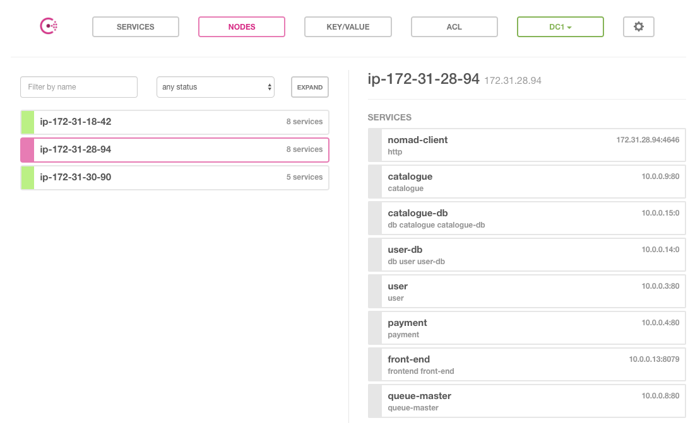
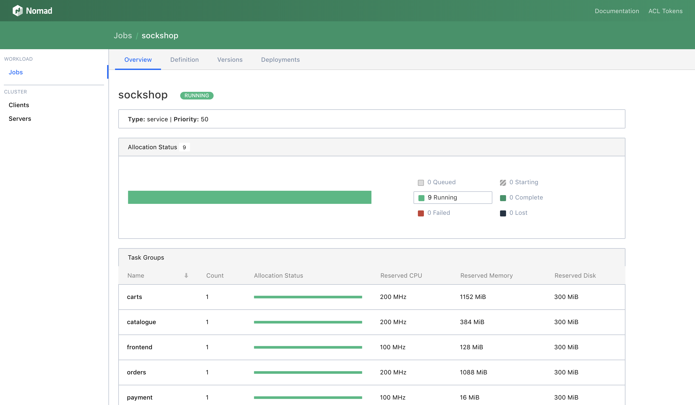

# Running the Sock Shop Microservices Demo
The Sock Shop Microservices Demo consists of 13 microservices which provide the customer-facing part of an e-commerce application. These services are written in several languages, including node.js, Java, and Go, and use RabbitMQ, one MySQL and three MongoDB databases. The demo is deployable on many platforms including Nomad.

## Reference Material
You can learn more about the demo at the [Sock Shop](https://microservices-demo.github.io/) website which also includes links to all the source code and Docker images used by the demo.

The instructions below describe how you can run and connect the Sock Shop microservices in AWS using [Nomad](https://www.nomadproject.io/) and [Consul](https://www.consul.io). Additionally, [Packer](https://www.packer.io) is used to build the AWS AMI that runs Nomad, Consul, and the microservices, [Terraform](https://www.terraform.io) is used to provision the AWS infrastructure (including a VPC and public subnet and EC2 instances), and [Vault](https://www.vaultproject.io) is used to dynamically generate  AWS keys for Terraform and to provide passwords for two of the Sock Shop databases.

## Estimated Time to Complete
90 minutes

## Personas
Our target persona is a developer who wants to run microservices with Nomad and connect them with Consul. They might also want to retrieve secrets from Vault.

## Challenge
Microservices such as the Sock Shop microservices can be deployed to multiple platforms including Docker Compose, Docker Swarm, Kubernetes, AWS ECS, Mesos, and Nomad. Some of these solutions are difficult to deploy and manage and more expensive to run since a minimal cluster can require 10-20 VMs. Another challenge is that some of the platforms such as Kubernetes only support Docker-based applications. What should you do if you have some legacy applications and don't want to containerize them?

## Solution

This guide illustrates how Nomad can schedule Docker and non-Docker apps in a single deployment. In our case, most of the Sock Shop microservices are launched in Docker containers, using Nomad's Docker Driver, but the queue-master Java application is launched with Nomad's Java driver.  Consul is used for service discovery and as a key/value store for a Docker overlay network that supports cross-host communication between the microservices.

## Prerequisites
In order to deploy the Sock Shop demo to AWS, you will need an AWS account. You will also need to know your AWS access and secret access [keys](http://docs.aws.amazon.com/general/latest/gr/aws-sec-cred-types.html#access-keys-and-secret-access-keys). You'll also need a [key pair](http://docs.aws.amazon.com/AWSEC2/latest/UserGuide/EC2-key-pairs.html) from your AWS account.

If you want to customize the AMI used by the demo, you will need to download and install Packer locally from [Packer Downloads](https://www.packer.io/downloads.html). You can use Terraform Enterprise or open source Terraform to provision the AWS infrastructure the demo runs on. If you want to use open source Terraform, install it from [Terraform Downloads](https://www.terraform.io/downloads.html). This demo was built and tested with Packer 1.3.1 and Terraform 0.11.8.

You will also need a Vault server that is accessible from your AWS account.  Ideally, you would run it in your AWS account. You can download Vault from [Vault Downloads](https://www.vaultproject.io/downloads.html). This demo was built and tested with Vault 0.10.1.

## Steps
Please execute the following commands and instructions to configure your Vault server, deploy the AWS infrastructure, and run the microservices with Nomad.

### Step 1: Configure your Vault Server for the Demo
We assume you have installed, initialized, and unsealed your Vault server and can run `vault` commands against it. We have provided a script to automate the rest of the configuration of the Vault server needed for this demo, but you still need to manually initialize and unseal Vault if you have just deployed a new Vault server to use with this demo.  If that is the case, please do the following two steps on your Vault server:

#### Step 1a: Initialize and Unseal your Vault Server (if needed)
1. Initialize your Vault server with `vault operator init -key-shares=1 -key-threshold=1`. Be sure to save your unseal key and root token.
1. Unseal your AWS Vault with `vault operator unseal`, providing your unseal key when prompted.

#### Step 1b: Export Environment Variables
The rest of the Vault server configuration can be automated by running the [setup_vault.sh](./vault/setup_vault.sh) script after setting some environment variables:
```
export AWS_ACCESS_KEY_ID=<your_aws_key>
export AWS_SECRET_ACCESS_KEY=<your_secret_key>
export VAULT_ADDR=<vault_address_with_port>
export VAULT_TOKEN=<vault_token>
```
replacing \<your_aws_key\> and \<your_secret_key\> with AWS keys that can create other keys, \<vault_address_with_port\> with the URL for your Vault server including the port, and \<vault_token\> with a Vault token for your server.

We document all the steps below for those who would rather configure Vault manually.

#### Step 1c: Configure AWS secrets engine on your Vault server
Instead of letting the setup_vault.sh script configure the AWS secrets engine, you could run the following commands from the vault directory, replacing \<your_key\> and \<your_secret_key\> below with your actual AWS keys.

```
vault secrets enable -path=aws-tf aws
vault write aws-tf/config/root \
 access_key=<your_key> \
 secret_key=<your_secret_key>
vault write aws-tf/config/lease lease=1h lease_max=24h
vault write aws-tf/roles/deploy policy=@aws-policy.json
```

If you want, test that you can dynamically generate AWS credentials by running `vault read aws-tf/creds/deploy`.  This will return an access key and secret key usable for 1 hour.

#### Step 1d: Create sockshop-read policy and write passwords
Nomad will fetch the cataloguedb and userdb passwords from Vault. We first create a Vault policy to allow that and then write the passwords to the pwd key of the secret/sockshop/databases/cataloguedb and secret/sockshop/databases/userdb paths. You can set any password you want.

```
vault policy write sockshop-read sockshop-read.hcl
vault write secret/sockshop/databases/cataloguedb pwd=dioe93kdo931
vault write secret/sockshop/databases/userdb pwd=wo39c5h2sl4r
```

### Step 1e: Configure Vault to Generate Tokens for Nomad
In order for Nomad to fetch the cataloguedb and userdb passwords from Vault, we need to set up some Vault policies. We import these into our Vault server with these commands:

```
vault policy write nomad-server nomad-server-policy.hcl
vault write auth/token/roles/nomad-cluster @nomad-cluster-role.json
```

### Step 1f: Generate a Vault Token for Nomad
You also need to generate a Vault token for Nomad by running
`vault token create -policy nomad-server -ttl=720h | sed -e '1,2d' | sed -e '2,6d' | sed 's/ //g' | sed 's/token//'`. This will give you a Vault token for Nomad valid for 30 days. You will need to enter this in your Terraform variables in Step 5.

## Step 2: Create a New AMI with Packer (optional)
You can now use Packer and Terraform to provision your AWS EC2 instances along with other AWS infrastructure. Terraform has already been configured to retrieve dynamically generated short-lived AWS keys from your Vault server.

We have already used Packer to create Amazon Machine Image ami-009feb0e09775afc6 which uses Nomad 0.8.6 and Consul 1.3.0. You can use this as the basis for your EC2 instances. This AMI only exists in the AWS us-east-1 region. If you want to create a similar AMI in a different region or if you make any changes to any of the files in the shared directory, you will need to create your own AMI with Packer. This is very simple. Starting from the home directory, do the following (being sure to specify the region and a vaid source_ami for that region in packer.json if the region is different from us-east-1):

```
export AWS_ACCESS_KEY_ID=<your_aws_key>
export AWS_SECRET_ACCESS_KEY=<your_aws_secret_key>
cd aws/packer
packer build packer.json
cd ..
```

Be sure to note the AMI ID of your new AMI. You will need to enter this in your Terraform variables in Step 5. If you generated this in a region other than us-east-1, then be sure to set the region variable in Step 5.

## Step 3: Create an AWS EC2 Key Pair (if needed)
You need to use one of your AWS EC2 key pairs or [create](http://docs.aws.amazon.com/AWSEC2/latest/UserGuide/EC2-key-pairs.html#having-EC2-create-your-key-pair) a new one. Please download your private key and copy it to the aws directory to make connecting to your EC2 instances easier in Step 7.

## Step 4: Set Up and Configure Terraform Enterprise
1. If you do not already have a Terraform Enterprise (TFE) account, self-register for an evaluation at https://app.terraform.io/account/new.
1. After getting access to your TFE account, create an organization for yourself. You might also want to review the [Getting Started](https://www.terraform.io/docs/enterprise/getting-started/index.html) documentation.
1. Connect your TFE organization to GitHub. See the [Configuring Github Access](https://www.terraform.io/docs/enterprise/vcs/github.html)documentation.

If you want to use open source Terraform instead of TFE, you can clone this repository locally, create a copy of the included terraform.tfvars.example file, calling it terraform.auto.tfvars, set values for the variables in it, run `terraform init`, and then run `terraform apply`.

## Step 5: Configure a Terraform Enterprise Workspace
1. Fork this repository by clicking the Fork button in the upper right corner of the screen and selecting your own personal GitHub account or organization.
1. Create a workspace in your TFE organization called microservices-demo.
1. Configure the workspace to connect to the fork of this repository in your own Github account.
1. Set the Terraform Working Directory to "application-deployment/microservices".
1. On the Variables tab of your workspace, add Terraform variables as described below.
1. If you used Packer to build a new AMI, set the ami variable to the AMI ID of the new AMI; otherwise, you can use the default value. If you built your AMI in a region different from us-east-1, then set the region variable to that region and set the subnet_az variable to an availability zone in that region.
1. Set the key_name variable to the name of your private key and set the private_key_data variable to the contents of the private key. Be sure to mark the private_key_data variable as sensitive.
1. Set the variables name_tag_prefix and cluster_tag_value to something like "\<your_name\>-microservices".
1. HashiCorp SEs should also set the owner and ttl variables which are used by the AWS Lambda reaper function that terminates old EC2 instances.
1. Set the vault_url variable to the address of your Vault server including the port. It should look like "http://<dns_or_ip>:8200".
1. Set the VAULT_TOKEN environment variable to a Vault token on your server that is allowed to use the AWS secrets engine and that has read access to the path "secret/sockshop". Be sure to mark the VAULT_TOKEN variable as sensitive so that other people cannot read it.
1. Set the token_for_nomad variable to the Vault token you generated for Nomad in Step 1f.

Now, you're ready to use Terraform to provision your EC2 instances.  The default configuration creates 1 Server instance running Nomad and Consul servers and 2 Client instances running Nomad and Consul clients. Your Sock Shop apps will be deployed by Nomad to the Client instances. If running t2.medium instances, you need a minimum of 2 clients to run all the Sock Shop microservices. You can set the instance types with server_instance_type and client_instance_type.

You can set server_count and client_count to larger numbers if desired.  We recommend 3 of each if you want to demonstrate that Nomad reschedules tasks if a client is terminated and that a new leader is elected in the cluster if one of the servers is terminated.

If desired, you can set the vpc_cidr and subnet_cidr to valid CIDR ranges. The defaults are "10.0.0.0/16" and "10.0.1.0/24" respectively.

## Step 6: Provision the Microservices Demo
1. Click the "Queue Plan" button in the upper right corner of your workspace.
1. On the Latest Run tab, you should see a new run. If the plan succeeds, you can view the plan and verify that the AWS infrastructure including the Nomad/Consul servers and clients will be created when you apply your plan.
1. Click the "Confirm and Apply" button to actually provision everything.

When the apply finishes, you should see a message giving the public and private IP addresses for all your server and client instances along with a command to ssh to one of your servers and URLs to access the Nomad and Consul UIs.  In your AWS console, you should be able to see all your instances under EC2 Instances. If you were already on that screen, you'll need to refresh it.

Note that Nomad and Consul will automatically be started and that Nomad will run the sockshop and sockshopui jobs. The latter runs the frontend node.js app on all client nodes.

## Step 7: Verification that Consul and Nomad are Running
From a directory containing your private EC2 key pair, you can connect to one of your Nomad servers with `ssh -i <key> ubuntu@<server_public_ip>`, replacing \<key\> with your actual private key file (ending in ".pem") and \<server_public_ip\> with the public IP of your server instance. The exact command should have been in the outputs of the apply.

After connecting, if you run the `pwd` command, you will see that you are in the /home/ubuntu directory. If you run the `ls` command, you should see the file sockshop.nomad.

If you run `consul members`, you should see all of the server and client instances.

Verify that Nomad is running with `ps -ef | grep nomad`. You should see "/usr/local/bin/nomad agent -config=/etc/nomad.d/nomad.hcl". If you run `nomad status`, you should see that the sockshop and sockshopui jobs are running.

You can verify that the sockshop Docker network was created with `docker network ls`. If you ssh-ed to one of your client instances, run this there too.

## Step 8: Verify Sock Shop Deployment
The demo will automatically launch the Sock Shop microservices with Nomad using the commands `nomad job run sockshop.nomad` and `nomad job run sockshopui.nomad`.  You do not need to run these yourself.

Note that the queue-master task is launched with the Java driver and that the queue-master.jar file is downloaded from a public S3 bucket.

You can check the status of the sockshop jobs on any of the servers or clients by running `nomad job status sockshop` and `nomad job status sockshopui`.  All tasks should be running. You can also see job status in the Nomad UI.

## Step 9: Using the Sock Shop application
You should now be able to access the Sock Shop UI with a browser on your laptop.  Just point your browser against http://<client_ip>, replacing \<client_ip\> with any of the client public IP addresses.

You can login to the Sock Shop as "Eve_Berger" with password "eve".  You can then browse through the catalogue, add some socks to your shopping cart, checkout, and view your order.


## Checking the Services with Consul UI
You can access the Consul UI by pointing your browser to http://<server_ip>:8500, replacing \<server_ip\> with the public IP address of one of your servers . You can verify that all of the Sock Shop microservices are registered with Consul and easily determine which of the client instances the different services are running on.



## Checking the Running Tasks with Nomad UI
You can access the Nomad UI by pointing your browser to http://<server_ip>:4646, replacing \<server_ip\> with the public IP address of one of your servers. You can verify that all of the Sock Shop microservices are running as Nomad tasks and easily determine which of the client instances the different tasks are running on.



## Cleanup
If you run this demo in Terraform Enterprise, then you should add the environment variable CONFIRM_DESTROY=1 (which is needed to destroy infrastructure in TFE) to your workspace. This is not needed if using Terraform OSS in which you can simply run `terraform destroy`.  In TFE, you should go to the Settings tab of your workspace and then click the "Queue destroy Plan" button.  Then confirm that you want to destroy when the run reaches the Apply stage of the run.
